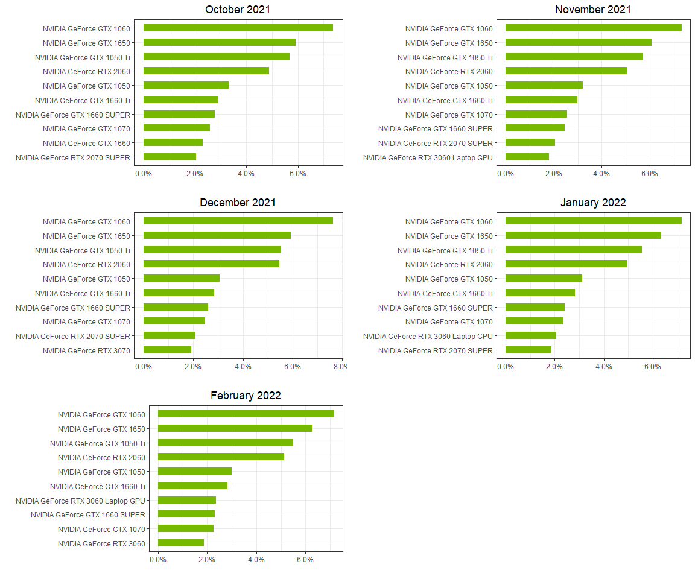
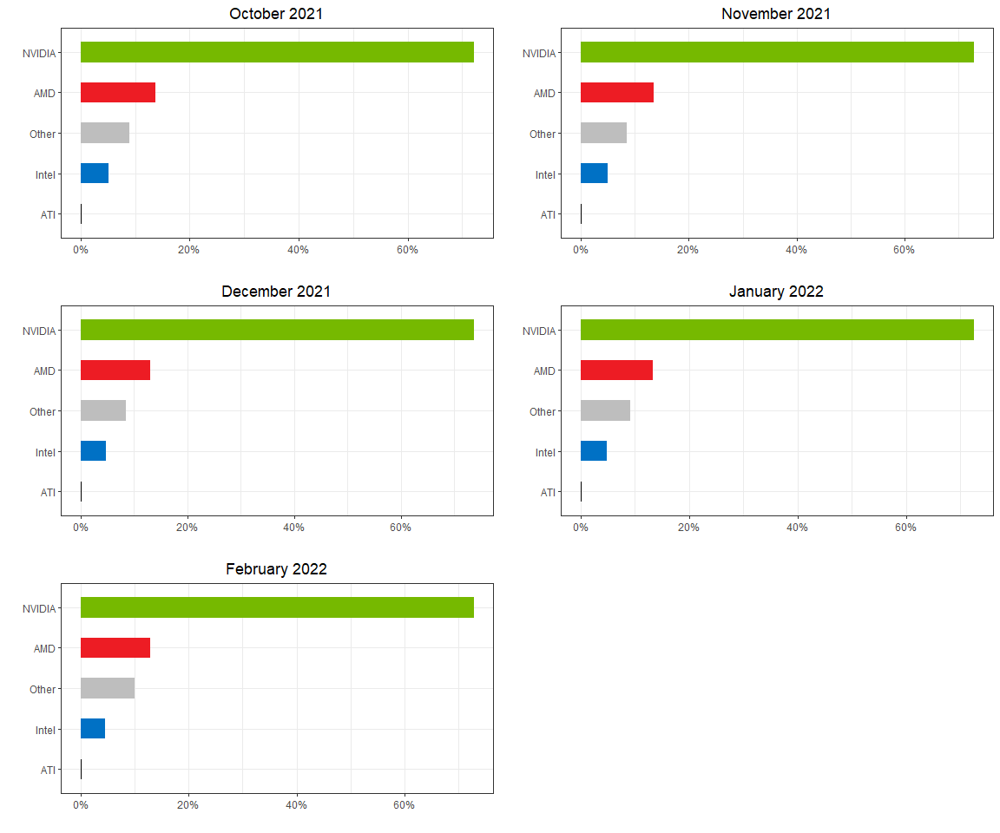

```r
# Use this R-Chunk to import all your datasets!
steam_og <- read_csv("C:/Users/jdavi/OneDrive/Desktop/steam_og.csv", col_names = FALSE)
```

## Background

Gaming has become one of the most popular forms of entertainment today. This analysis aims to discover what type of hardware computer gamers are using. Specifically we will be looking at graphic cards. In the analysis we will look to discover the top 10 graphic cards used between the months of October 2021 to February 2022. The Data used in this analysis was scraped from Steam.com which as of December 2021 had approximately 120 million active user accounts.

The two main questions we are aiming to answer are:

1. What are the top 10 graphic cards used for each month?
2. What is the percentage of graphic card use per manufacturer for each month?


## Example of Starting Dataset

After scraping the data from Steam and importing it into R, a quick view of the data shows there will need to be some cleaning done before it can be analyzed.

The manner the data is suppose to read is with multiple columns, one column will have the name of the column, there should then be 5 additional columns that correspond to the months October to  Feb, the last column is a difference column that shows rhe difference between January and Febraury.

```r
(steam_og %>% head(n=11)) %>% pander()
```


------------------------
           X1           
------------------------
  NVIDIA Quadro M5000   

         0.00%          

         0.00%          

         0.00%          

         0.00%          

         0.00%          

         0.00%          

           NA           

           NA           

           NA           

 AMD Radeon Pro Vega 48 
------------------------

## Data Cleaning


```r
## removing blank rows

steam_og1 <- steam_og %>% 
  drop_na()

## puts the data int a matrix with 7 columns

steam <- data.frame(matrix(steam_og1$X1, ncol = 7,byrow = TRUE))

## renames columns

names(steam)[1] <- "gpu"
names(steam)[2] <- "Oct"
names(steam)[3] <- "Nov"
names(steam)[4] <- "Dec"
names(steam)[5] <- "Jan"
names(steam)[6] <- "Feb"
names(steam)[7] <- "Diff"

## creating a new manufacturer column

steam <- steam %>% 
  mutate(manufacturer = str_extract(steam$gpu,"(\\w+)"))

## removing the % sign from the months and diff columns

steam <- steam %>% 
  mutate(Oct = substring(steam$Oct,1,nchar(steam$Oct)-1)) %>%
  mutate(Nov = substring(steam$Nov,1,nchar(steam$Nov)-1)) %>%
  mutate(Dec = substring(steam$Dec,1,nchar(steam$Dec)-1)) %>%
  mutate(Jan = substring(steam$Jan,1,nchar(steam$Jan)-1)) %>%
  mutate(Feb = substring(steam$Feb,1,nchar(steam$Feb)-1)) %>%
  mutate(Diff = substring(steam$Diff,1,nchar(steam$Diff)-1))

## setting the column types

steam$Oct <- as.numeric(steam$Oct)
steam$Nov <- as.numeric(steam$Nov)
steam$Dec <- as.numeric(steam$Dec)
steam$Jan <- as.numeric(steam$Jan)
steam$Feb <- as.numeric(steam$Feb)
steam$Diff <- as.numeric(steam$Diff)

## changing BLANKS or NAs to 0

steam[is.na(steam)] = 0

## Removing Duplicate Rows

steam <- steam %>%
  distinct(gpu, .keep_all = TRUE)

## Removed the "other" category as there is a known issue of gpu's being counted in this category that should not be.
steam <- steam[-138,]


## Creatign a new dataframe that gives the sum of use for each manufactuer per month
manufacturer <- steam %>% 
  group_by(manufacturer) %>% 
  summarise(across(c(Oct,Nov,Dec,Jan,Feb,Diff),list(sum)))%>%
  select(manufacturer,Oct_1,Nov_1,Dec_1,Jan_1,Feb_1)

names(manufacturer)[2] <- "Oct"
names(manufacturer)[3] <- "Nov"
names(manufacturer)[4] <- "Dec"
names(manufacturer)[5] <- "Jan"
names(manufacturer)[6] <- "Feb"


## Creating a new Other Column to more accuretly represent "other" gpus

other <- c( "Other",
            round(100 - sum(manufacturer[2]),2),
            round(100 - sum(manufacturer[3]),2),
            round(100 - sum(manufacturer[4]),2),
            round(100 - sum(manufacturer[5]),2),
            round(100 - sum(manufacturer[6])),2)

manufacturer <- rbind(manufacturer,other)

## Setting the column types

manufacturer$manufacturer <- as.factor(manufacturer$manufacturer)
manufacturer$Oct <- as.numeric(manufacturer$Oct)
manufacturer$Nov <- as.numeric(manufacturer$Nov)
manufacturer$Dec <- as.numeric(manufacturer$Dec)
manufacturer$Jan <- as.numeric(manufacturer$Jan)
manufacturer$Feb <- as.numeric(manufacturer$Feb)

## Creating smaller dataframes for top 10 of each month

Oct_top10 <- steam %>%
  arrange(desc(steam$Oct)) %>%
  slice(1:10) %>%
  select(gpu,Oct,manufacturer)

Nov_top10 <- steam %>%
  arrange(desc(steam$Nov)) %>%
  slice(1:10) %>%
  select(gpu,Nov,manufacturer)

Dec_top10 <- steam %>%
  arrange(desc(steam$Dec)) %>%
  slice(1:10) %>%
  select(gpu,Dec,manufacturer)

Jan_top10 <- steam %>%
  arrange(desc(steam$Jan)) %>%
  slice(1:10) %>%
  select(gpu,Jan,manufacturer)

Feb_top10 <- steam %>%
  arrange(desc(steam$Feb)) %>%
  slice(1:10) %>%
  select(gpu,Feb,manufacturer)
```


## Example of Dataset After Cleaning the Data

**First 5 Rows**


```r
(steam %>% head(n=5)) %>% pander()
```


--------------------------------------------------------------------------------
            gpu               Oct   Nov   Dec   Jan   Feb   Diff   manufacturer 
---------------------------- ----- ----- ----- ----- ----- ------ --------------
    NVIDIA Quadro M5000        0     0     0     0     0     0        NVIDIA    

   AMD Radeon Pro Vega 48      0     0     0     0     0     0         AMD      

 AMD Radeon HD 6800M Series    0     0     0     0     0     0         AMD      

     AMD Radeon R9 M385        0     0     0     0     0     0         AMD      

    NVIDIA Quadro K620M        0     0     0     0     0     0        NVIDIA    
--------------------------------------------------------------------------------


After we have cleaned our data we can seee how much more easy it is to read. During the data cleaning process and additional column was made to show the manufacturer of the graphic card. This will help create a grouping variable in our analysis.

## Top 10 Graphic Cards by Month


```r
# Use this R-Chunk to plot & visualize your data!


#datatable(steam, class = 'cell-border stripe')

b1 <- ggplot()+
  geom_col(aes(y=reorder(gpu,Oct),x=Oct/100),data = Oct_top10, fill = "#76b900", width = 0.5)+
  labs(title = "October 2021",x="",y="")+
  scale_x_continuous(labels = scales::percent)+
  theme_bw()+
  theme(plot.title = element_text(hjust = 0.5),legend.position = "none")
  
  
  
b2 <-ggplot()+
  geom_col(aes(y=reorder(gpu,Nov),x=Nov/100),data = Nov_top10, fill = "#76b900", width = 0.5)+
  labs(title = "November 2021",x="",y="")+
  scale_x_continuous(labels = scales::percent)+
  theme_bw()+
  theme(plot.title = element_text(hjust = 0.5),legend.position = "none")


b3 <-ggplot()+
  geom_col(aes(y=reorder(gpu,Dec),x=Dec/100),data = Dec_top10, fill = "#76b900", width = 0.5)+
  labs(title = "December 2021",x="",y="")+
  scale_x_continuous(labels = scales::percent)+
  theme_bw()+
  theme(plot.title = element_text(hjust = 0.5),legend.position = "none")


b4 <-ggplot()+
  geom_col(aes(y=reorder(gpu,Jan),x=Jan/100),data = Jan_top10, fill = "#76b900", width = 0.5)+
  labs(title = "January 2022",x="",y="")+
  scale_x_continuous(labels = scales::percent)+
  theme_bw()+
  theme(plot.title = element_text(hjust = 0.5),legend.position = "none")


b5 <-ggplot()+
  geom_col(aes(y=reorder(gpu,Feb),x=Feb/100),data = Feb_top10, fill = "#76b900", width = 0.5)+
  labs(title = "February 2022",x="",y="")+
  scale_x_continuous(labels = scales::percent)+
  theme_bw()+
  theme(plot.title = element_text(hjust = 0.5),legend.position = "none")

ggarrange(b1,b2,b3,b4,b5,
          ncol = 2,nrow = 3)
```

<!-- -->

NVIDIA is known for leading the market in graphic card sales. We can clearly see how dominate they are compared to competitors. In each month analyzed, all top 10 cards were manufactured by NVIDIA with the the GEforce GTX 1060 accounting for approximately 8% of all graphic cards used by steam users.


## Graphic Card Use By Manufactuer Per Month


```r
par(mfcol=c(2,3))

#Nvidia "#76b900"
#AMD "#ED1C24"
#Intel "#0071c5"
#ATI "Black"
#Other "Grey"

pallete <- c("#ED1C24","Black","#0071c5","#76b900","Grey")

a1 <- ggplot(manufacturer)+
  geom_col(aes(y=reorder(manufacturer,Oct),x=Oct/100,fill = manufacturer, width = 0.5))+
  scale_x_continuous(labels = scales::percent)+
  labs(title = "October 2021",x="",y="")+
  theme_bw()+
  theme(plot.title = element_text(hjust = 0.5),legend.position = "none")+
  scale_fill_manual(values = pallete)

a2 <-ggplot(manufacturer)+
  geom_col(aes(y=reorder(manufacturer,Nov),x=Nov/100,fill = manufacturer, width = 0.5))+
  scale_x_continuous(labels = scales::percent)+
  labs(title = "November 2021",x="",y="")+
  theme_bw()+
  theme(plot.title = element_text(hjust = 0.5),legend.position = "none")+
  scale_fill_manual(values = pallete)

a3 <-ggplot(manufacturer)+
  geom_col(aes(y=reorder(manufacturer,Dec),x=Dec/100,fill = manufacturer, width = 0.5))+
  scale_x_continuous(labels = scales::percent)+
  labs(title = "December 2021",x="",y="")+
  theme_bw()+
  theme(plot.title = element_text(hjust = 0.5),legend.position = "none")+
  scale_fill_manual(values = pallete)

a4 <-ggplot(manufacturer)+
  geom_col(aes(y=reorder(manufacturer,Jan),x=Jan/100,fill = manufacturer, width = 0.5))+
  scale_x_continuous(labels = scales::percent)+
  labs(title = "January 2022",x="",y="")+
  theme_bw()+
  theme(plot.title = element_text(hjust = 0.5),legend.position = "none")+
  scale_fill_manual(values = pallete)

a5 <-ggplot(manufacturer)+
  geom_col(aes(y=reorder(manufacturer,Feb),x=Feb/100,fill = manufacturer, width = 0.5))+
  scale_x_continuous(labels = scales::percent)+
  labs(title = "February 2022",x="",y="")+
  theme_bw()+
  theme(plot.title = element_text(hjust = 0.5),legend.position = "none")+
  scale_fill_manual(values = pallete)

ggarrange(a1,a2,a3,a4,a5,
          ncol = 2,
          nrow = 3)
```

<!-- -->

Again looking over this data we can see how much more users have a NVIDIA card compared to their competitors. NVIDIA makes up for over 70% off all graphic cars usage of steam users. Unsurprisingly there is little change per month. Graphic cards are an expensive item to purchase and in recent years due supply chain issues many tech companies have had problems keeping up with demand of customers. The table below helps give specific numbers on percentage of use for each manufacturer.


```r
#datatable(manufacturer, class = 'cell-border stripe')

(manufacturer %>% head(n=5)) %>% pander()
```


------------------------------------------------------
 manufacturer    Oct     Nov     Dec     Jan     Feb  
-------------- ------- ------- ------- ------- -------
     AMD        13.67   13.54   13.05   13.29   12.96 

     ATI        0.18    0.18    0.16    0.16    0.17  

    Intel       5.14    4.97    4.78    4.87    4.48  

    NVIDIA      72.1    72.75   73.59   72.5    72.81 

    Other       8.91    8.56    8.42    9.18     10   
------------------------------------------------------

## Conclusions

At the end of this analysis we can say that we successfully answered both of our questions. NVIDIA on an individual graphic card level and as a whole is the most used by steam users. It would be interesting to see how this changes in the next couple of years especially as supply becomes more available for these manufacturers.

